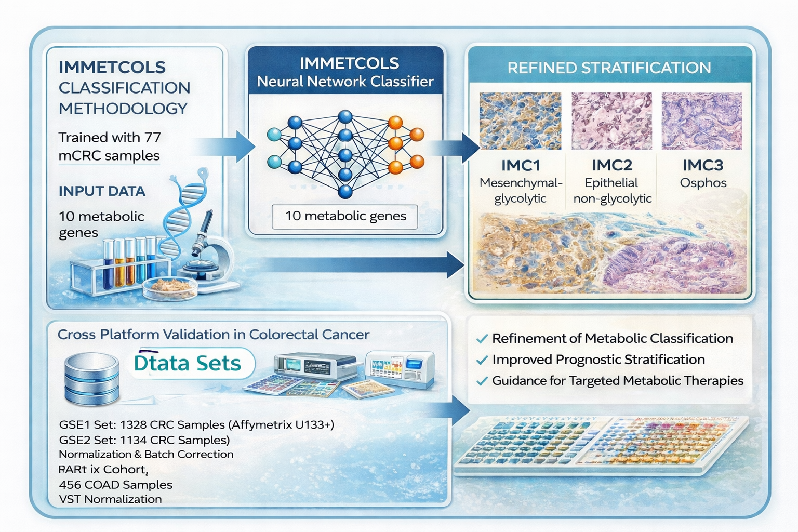

# IMMETCOLS_Signature
IMMETCOLS Immune-Metabolic Signature for Colorectal Cancer: Functional and Prognostic Stratification 

This repository contains resources developed for classifying samples according to the IMMETCOLS signature, a model designed to identify three molecular subtypes in transcriptomic data.

**Classifier/**

Includes the main algorithm for classifying samples into the three clusters defined by the IMMETCOLS signature. The code is designed to work with datasets of CRC samples and generate cluster assignments.

**Figures/**

Contains heatmaps generated after classification, showing the distribution of samples across the three clusters for different datasets. 

